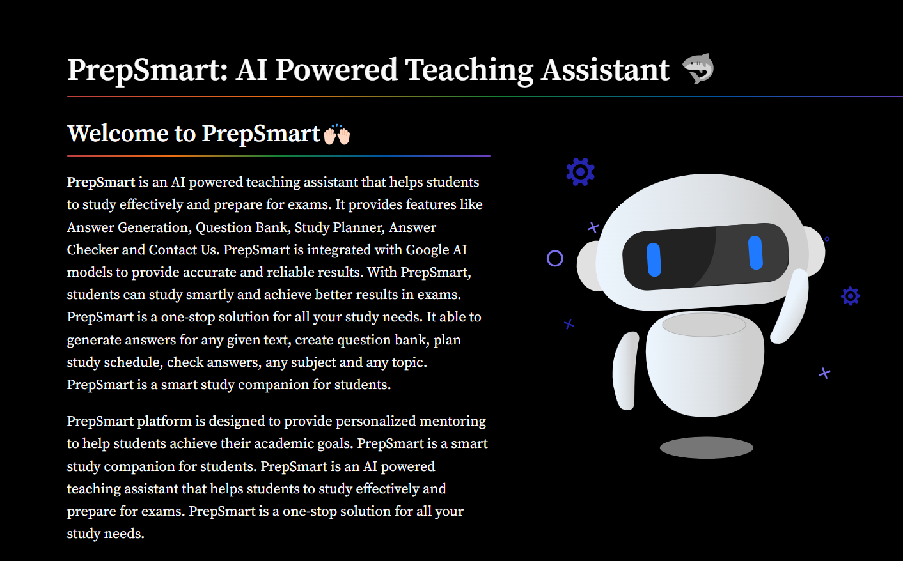
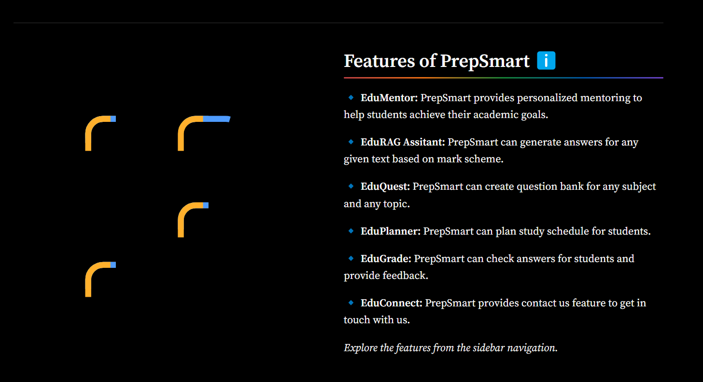

# PrepSmart: AI Powered Teaching Assistant 🤖

### 🎯 Project Overview
- PrepSmart is an AI-driven web application designed to help college and school students prepare for their upcoming exams.
- It generates answers based on specific marks, syllabus, and student notes using advanced Retrieval-Augmented Generation (RAG) models.
- Provides a seamless and personalized learning experience by integrating AI-powered features.

    

### 🎯 Objective
- Enable students to generate quality answers without worrying about prompt engineering.
- Generate important questions based on faculty-provided syllabus and notes.
- Offer personalized study plans, question banks, and answer evaluation for better learning.

### 🚀 Features Offered
1. AI-Powered Answer Generation – Get precise answers based on question marks and subjects.
2. Question Bank Generation – Create key questions from provided syllabus and notes.
3. Personal Mentor for Doubts – Get instant support and explanations for complex concepts.
4. Study Planner – Plan and track study schedules with personalized recommendations.
5. Answer Checker with Feedback – Evaluate answers and receive improvement suggestions.
6. Contact Us – Submit queries and feedback directly through the platform.

    

### 🔥 Why PrepSmart?
1. AI-Powered Efficiency – Save time with accurate and relevant answers.
2. Customizable Answer Sources – Choose between LLM models or uploaded notes.
3. Personalized Learning Journey – Tailor study plans and goals for success.
4. Seamless Question Bank Creation – Focus on high-priority topics.
5. Instant Feedback & Analysis – Get actionable insights for improvement.
6. User-Friendly Interface – Easy navigation and seamless experience.